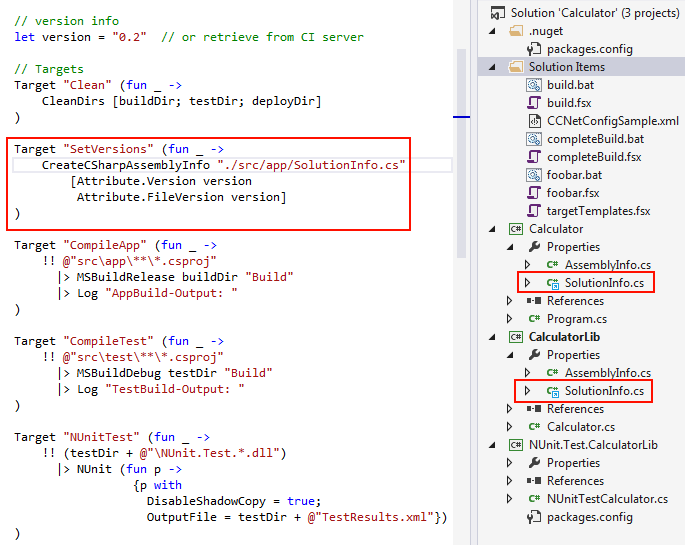
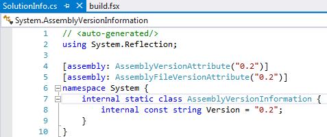

# Generating AssemblyInfo files

In this article the AssemblyInfo task is used in order to set specific version information to .NET assemblies.

If you succeeded with the [Getting Started tutorial](gettingstarted.html), then you just have to modify your *BuildApp* target to the following:

    open Fake.AssemblyInfoFile

	Target "BuildApp" (fun _ ->
		CreateCSharpAssemblyInfo "./src/app/Calculator/Properties/AssemblyInfo.cs"
			[Attribute.Title "Calculator Command line tool"
			 Attribute.Description "Sample project for FAKE - F# MAKE"
			 Attribute.Guid "A539B42C-CB9F-4a23-8E57-AF4E7CEE5BAA"
			 Attribute.Product "Calculator"
			 Attribute.Version version
			 Attribute.FileVersion version]

		CreateCSharpAssemblyInfo "./src/app/CalculatorLib/Properties/AssemblyInfo.cs"
			[Attribute.Title "Calculator library"
			 Attribute.Description "Sample project for FAKE - F# MAKE"
			 Attribute.Guid "EE5621DB-B86B-44eb-987F-9C94BCC98441"
			 Attribute.Product "Calculator"
			 Attribute.Version version
			 Attribute.FileVersion version]

		MSBuildRelease buildDir "Build" appReferences
		  |> Log "AppBuild-Output: "
	)

As you can see generating an AssemblyInfo.cs file is pretty easy with FAKE. You can read more about the C# and F# AssemblyInfo tasks in the [API docs](apidocs/fake-assemblyinfofile.html).

## Setting the version no.

The version parameter can be declared as a property or fetched from a build server like TeamCity:

	let version =
	  match buildServer with
	  | TeamCity -> buildVersion
	  | _ -> "0.2"

## Using the SolutionInfo approach

Some companies split their AssemblyInfo into a SolutionInfo.cs which is shared by all projects and a specific AssemblyInfo per project which contains the product data. 
All versioning data is generated by the AssemblyInfo task into the SolutionInfo.cs and the AssemblyInfo files are editied manually. This could look like this:

The generated SolutionInfo.cs looks like this:

